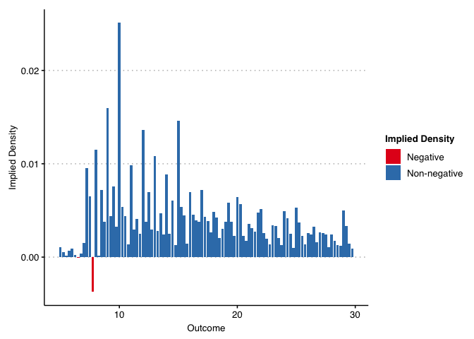

<!-- README.md is generated from README.Rmd. Please edit that file -->

# Difference-in-Differences and Functional Form

<!-- badges: start -->


<!-- badges: end -->

The `didFF` R package assesses when the validity of
difference-in-differences and related estimators depends on functional
form, based on the theoretical results in [Roth and Sant’Anna
(2023)](https://doi.org/10.3982/ECTA19402). This package provides a test
for whether parallel trends is insensitive to functional form by
estimating the implied density of potential outcomes under the null and
checking if it is significantly below zero at some point.

## Installation

You can install the development version of didFF from
[GitHub](https://github.com/) with:

``` r
#Install the remotes package if not already installed
# install.packages("remotes")

#Install the didFF package using remotes
remotes::install_github("pedrohcgs/didFF")
```

## Example

We now provide and example of how to use the package using the empirical
illustration from [Roth and Sant’Anna (2023,
p. 743–744)](https://doi.org/10.3982/ECTA19402).

## Loading the package and the data

We first load the package and the data.

``` r
# Load didFF and other auxiliary libraries for data manipulation
library(didFF)
library(tidyverse) 
library(dplyr)

mw_df<-didFF::Cengiz_df #load Cengiz et al. (2019) data frame
```

The data is derived from the dataset compiled by [Cengiz et
al. (2019)](https://doi.org/10.1093/qje/qjz014). For each state and
year, it provides the number of people employed at each wage level
(coarsened to 25c bins), with a value of 0 for people not in the labor
force. It also contains an indicator variables (treated) for whether a
state raised its minimum wage in the given year.

``` r
head(mw_df, 5)
#>   wagebins statenum year quarterdate overallcountpc treated_quarter
#> 1      100        1 2007         188    0.000000000               0
#> 2      100        1 2007         189    0.000000000               0
#> 3      100        1 2007         190    0.000000000               0
#> 4      100        1 2007         191    0.000000000               0
#> 5      100        1 2008         192    0.001836395               0
#>   treated_year   MW population
#> 1            0 5.15    3578266
#> 2            0 5.15    3564137
#> 3            0 5.85    3576752
#> 4            0 5.85    3583092
#> 5            0 5.85    3577623
```

## Testing Functional Form for DiD between 2007 and 2015

We will now test whether a DiD analysis for the effect of the minimum
wage on wages (weighted by population) is insensitive to functional
form—i.e. that parallel trends is valid regardless of whether wages are
measured in levels, logs, percentiles, etc. We first consider an
analysis where the pre-treatment period is 2007, the post-treatment
period is 2015, and the treatment is whether a state raised its minimum
wage at any point between the pre-treatment and post-treatment periods.
We call didFF as follows:

``` r
# Create treatment groups according to the description above
start_t = 2007 # pre-treatment year
end_t   = 2015 # post-treatment year

# Create dataset
mw_df_2007_2015 <- 
  mw_df %>%
  # filter out data outside the time window of interest
  dplyr::filter((start_t <= year) & (year <= end_t)) %>% 
  dplyr::group_by(statenum) %>%
  # Create group variable that take value end_t if state was ever treated in this period, and 0 otherwise
  dplyr::mutate(group = max(treated_quarter > 0, na.rm=TRUE)*end_t) %>% 
  #filter data back to pre and post periods only
  dplyr::filter((year == start_t) | (year == end_t)) %>%
  dplyr::group_by(statenum, wagebins) %>%
  dplyr::mutate(wagebins=wagebins/100, wgt=overallcountpc*population) %>%
  dplyr::filter(wgt >= 0)

# Run the test (Replicates Figure 2a in Roth and Sant'Anna, 2023)
test_2007_2015 <- didFF(
  data        = mw_df_2007_2015,
  idname      = "statenum",
  yname       = "wagebins",
  tname       = "year",
  gname       = "group",
  weightsname = "wgt",
  est_method  = "reg",
  binpoints   = sort(unique(mw_df_2007_2015$wagebins)),
  allow_unbalanced_panel = TRUE,
  lb_graph    = 5,
  ub_graph    = 29.75,
  seed        = 1
)
#> Warning in didFF(data = mw_df_2007_2015, idname = "statenum", yname =
#> "wagebins", : You have observations with g=0 and all time periods t>0; assuming
#> the g=0 cohort is never-treated.

test_2007_2015$plot
```


``` r
test_2007_2015$pval
#> [1] 0
```

The plot shows the implied counterfactual density for the treated group
if parallel trends holds for all functional forms of the outcome, which
Roth and Sant’Anna show is equivalent to “parallel trends of
distributions”. (To preserve reasonable scaling, we use the options
`lb_graph` and `ub_graph` so that the plot shows only wages above 5 and
below 30). The figure shows that the implied density is negative for
wages between approximately \$5-7/hour.

The plot also shows a formal p-value for the null hypothesis that
parallel trends holds for all functional forms (this is calculated using
a “least-favorable” critical value for moment inequalities, as in, e.g.,
Section 4.1.1 of [Canay and Shaikh
(2017)](https://doi.org/10.1017/9781108227223.009)). The test shows that
we are able to reject the null hypothesis that all of the implied
densities are positive (p\<0.001). We thus reject the null that parallel
trends hold for all functional forms of the outcome.

## Testing Functional Form for DiD between 2010 and 2015

By contrast, results using the period 2010-2015 shows that the estimated
counterfactual distribution has positive density nearly everywhere, and
we cannot formally reject the hypothesis that it is positive everywhere
(p=0.293). This does not necessarily imply that parallel trends holds
for all transformations of the outcome, but insensitivity to functional
form is not rejected by the data in this example.

``` r
start_t = 2010
mw_df_2010_2015 <- 
  mw_df %>%
  dplyr::filter((start_t <= year) & (year <= end_t)) %>%
  dplyr::group_by(statenum) %>%
  dplyr::mutate(group = max(treated_quarter > 0,na.rm=TRUE)*end_t) %>%
  dplyr::filter((year == start_t) | (year == end_t)) %>%
  dplyr::group_by(statenum, wagebins) %>%
  dplyr::mutate(wagebins=wagebins/100, wgt=overallcountpc*population) %>%
  dplyr::filter(wgt >= 0)

# Run the test (Replicates Figure 2b in Roth and Sant'Anna, 2023)
test_2010_2015 <- didFF(
  data        = mw_df_2010_2015,
  idname      = "statenum",
  yname       = "wagebins",
  tname       = "year",
  gname       = "group",
  weightsname = "wgt",
  est_method  = "reg",
  binpoints   = sort(unique(mw_df_2010_2015$wagebins)),
  allow_unbalanced_panel = TRUE,
  lb_graph    = 5,
  ub_graph    = 29.75,
  seed        = 1
)
#> Warning in didFF(data = mw_df_2010_2015, idname = "statenum", yname =
#> "wagebins", : You have observations with g=0 and all time periods t>0; assuming
#> the g=0 cohort is never-treated.

test_2010_2015$plot
```



``` r
test_2010_2015$pval
#> [1] 0.3317
```

## Distributional Treatement Effects

Under parallel trends it is possible to compute the counterfactual
distribution of the treated group, which is the distribution of `Y(1)`
minus the implied distribution of `Y(0)` for treated groups.

``` r
dist_2007_2015 <- distDD(
  data        = mw_df_2007_2015,
  idname      = "statenum",
  yname       = "wagebins",
  tname       = "year",
  gname       = "group",
  weightsname = "wgt",
  est_method  = "reg",
  binpoints   = sort(unique(mw_df_2007_2015$wagebins)),
  allow_unbalanced_panel = TRUE,
  seed        = 1
)
#> Warning in didFF(..., distDD = TRUE): You have observations with g=0 and all
#> time periods t>0; assuming the g=0 cohort is never-treated.

head(dist_2007_2015$table)
#>        level test.estimates      test.se
#> 1      [0,1]  -4.930592e-03 7.160771e-03
#> 2   (1,1.25]  -5.071141e-05 9.575429e-05
#> 3 (1.25,1.5]   1.069623e-05 6.171445e-05
#> 4 (1.5,1.75]   4.698969e-05 6.634287e-05
#> 5   (1.75,2]  -2.211360e-03 3.352551e-04
#> 6   (2,2.25]   9.703339e-04 4.718257e-04
```
